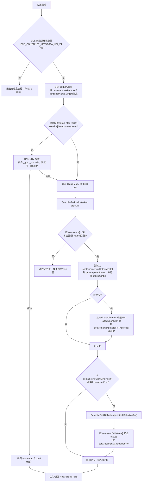
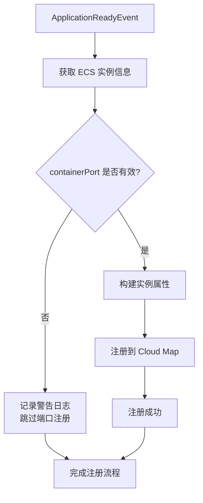
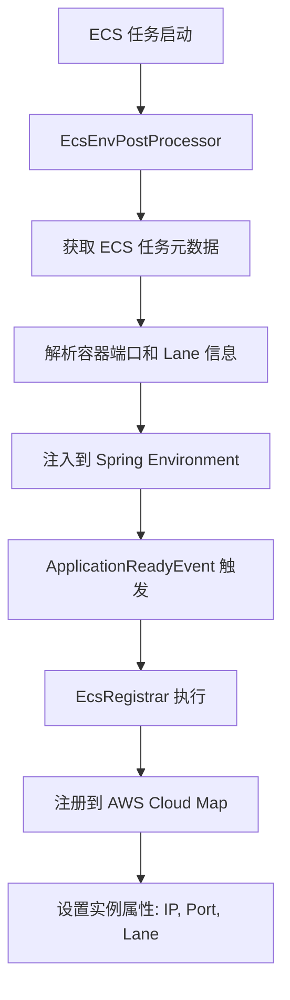
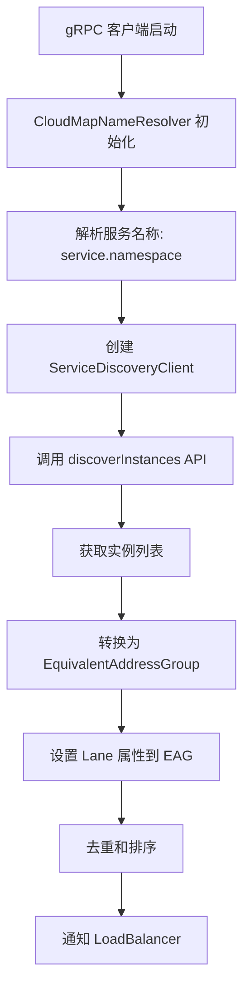
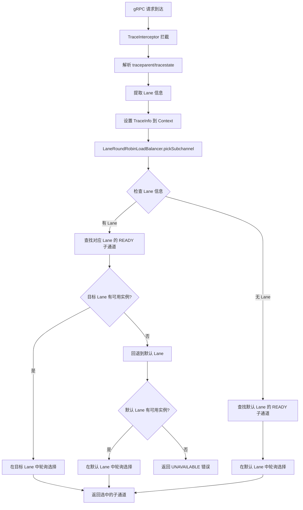

# Argus Spring Boot Starter

Argus 是一个面向 Spring Boot + gRPC 的 Starter，在 AWS ECS 上实现了自研的“泳道路由（lane-aware routing）”与分布式链路追踪能力，且完全兼容 W3C Trace Context：
- Trace 通过 `traceparent` 与 `tracestate` 传播
- Lane 通过 `tracestate: ctx=lane:<laneName>` 传播
- gRPC 目标为 `cloud:///...` 时按 lane 优先路由；为 `dns:///...` 或直连时使用系统默认

---

## 功能特性
- 开箱即用的追踪：自动解析/写回 `traceparent`/`tracestate`，注入日志 MDC
- lane 感知负载均衡：同泳道优先、默认兜底的轮询策略
- ECS/Cloud Map 集成：容器内自动启用 `cloud:///` 解析与实例注册
- Spring Boot Starter：最小侵入、条件装配、与 `net.devh.boot.grpc` 生态兼容

---

## 快速上手

### 1) 添加依赖
```xml
<dependency>
  <groupId>com.ddm</groupId>
  <artifactId>argus-spring-boot-starter</artifactId>
  <version>1.0-SNAPSHOT</version>
</dependency>
```

### 2) 基本配置
- Web 应用推荐日志格式（包含 traceId/lane）：
```yaml
logging:
  pattern:
    console: "%d{yyyy-MM-dd HH:mm:ss.SSS} [%thread] %-5level [%X{lane:--}] [%X{traceId:--}] %logger{36} - %msg%n"
```

### 3) gRPC 客户端地址
- 本地直连（static）：
```yaml
grpc:
  client:
    order-service:
      address: static://localhost:8082
      negotiationType: plaintext
```
- 使用 Cloud Map（ECS，下述为 `test` profile）：
```yaml
spring:
  config:
    activate:
      on-profile: test

grpc:
  client:
    order-service:
      address: "cloud:///order.test.local:${GRPC_SERVER_PORT:8081}"
```

---

## 工作原理

### ECS 元数据获取流程


### ECS 实例注册流程


### 服务实例发现和路由流程

#### 服务注册阶段


#### 服务发现阶段


#### Lane-aware 路由阶段


### 核心组件说明
- TraceAutoConfiguration：自动注册追踪组件；Web 环境注册 `TraceFilter`，所有环境注册 `TraceInterceptor`。
- TraceFilter：HTTP 入站解析 `traceparent`/`tracestate`，回写标准头，注入日志 MDC。
- TraceInterceptor：gRPC 入站解析、出站写入 `traceparent`/`tracestate`，透传/清理 lane 信息。
- EcsAutoConfiguration：仅在存在 `ECS_CONTAINER_METADATA_URI_V4` 时启用；注册 Cloud Map 解析器与（可选）实例注册器。
- CloudMapNameResolverProvider：支持 `cloud:///service.namespace[:port]` 协议，创建对应解析器。
- CloudMapNameResolver：从 Cloud Map 发现实例，将 lane 写入地址属性供负载均衡使用。
- GrpcLbAutoConfiguration：当目标为 `cloud:///` 时禁用服务端 service-config 覆盖，默认启用 `lane_round_robin` 策略。
- LaneLoadBalancerProvider/LaneRoundRobinLoadBalancer：按 lane 优先、默认兜底的轮询；无可用子通道时报 UNAVAILABLE。

### 路由机制详解

#### 1. 服务注册流程
1. **ECS 任务启动** - ECS 任务在指定泳道启动，任务定义包含 Lane 标签
2. **元数据获取** - `EcsEnvPostProcessor` 获取任务元数据，解析容器端口、IP、Lane 等信息
3. **Cloud Map 注册** - `EcsRegistrar` 监听 `ApplicationReadyEvent`，将实例信息注册到 AWS Cloud Map，设置属性：`IPV4`, `PORT`, `LANE`

#### 2. 服务发现流程
1. **NameResolver 初始化** - 解析目标服务：`service.namespace[:port]`，创建 `ServiceDiscoveryClient`
2. **实例发现** - 调用 `discoverInstances` API，获取所有健康实例
3. **EAG 转换** - 将实例转换为 `EquivalentAddressGroup`，设置 Lane 属性到 EAG Attributes，按 Lane、Host、Port 排序去重

#### 3. 路由选择流程
1. **请求拦截** - `TraceInterceptor` 拦截出站请求，解析 `traceparent` 和 `tracestate` header，提取 Lane 信息
2. **负载均衡选择** - `LaneRoundRobinLoadBalancer` 接收选择请求，根据 Lane 信息选择目标子通道池，使用轮询算法选择具体实例
3. **回退机制** - 优先选择指定 Lane 的实例，如果指定 Lane 无可用实例，回退到默认 Lane，如果默认 Lane 也无实例，返回 UNAVAILABLE

#### 4. 关键数据结构
- **TraceInfo**: 包含 `traceId`, `parentId`, `spanId`, `flags`, `lane` 信息
- **ScKey**: 子通道键，包含地址列表和泳道标识
- **EAG**: 等效地址组，包含地址和 Lane 属性

---

## ECS / Cloud Map 集成
- 启用条件：容器内存在 `ECS_CONTAINER_METADATA_URI_V4`。
- 地址协议：`cloud:///service.namespace[:port]`。
- 泳道注入：入口/网关可通过请求头注入 `tracestate: ctx=lane:<laneName>`；链路将自动透传并按泳道优先路由。

### 使用示例

#### 1. 服务端注册
```java
// 自动注册到 Cloud Map
@SpringBootApplication
public class MyServiceApplication {
    public static void main(String[] args) {
        SpringApplication.run(MyServiceApplication.class, args);
    }
}
```

#### 2. 客户端调用
```java
// 设置 Lane 信息
TraceInfo traceInfo = TraceInfo.root("canary");
Context ctx = Context.current()
    .withValue(TraceContext.CTX_TRACE_INFO, traceInfo);

// gRPC 调用会自动路由到对应 Lane
MyServiceGrpc.MyServiceBlockingStub stub = 
    MyServiceGrpc.newBlockingStub(channel);
Response response = stub.myMethod(request);
```

#### 3. HTTP 请求
```bash
# 通过 tracestate header 指定 Lane
curl -H "tracestate: ctx=lane:canary" \
     http://my-service/api/endpoint
```

### 优势特性
1. **✅ Lane-aware 路由**: 基于泳道的精确路由
2. **✅ 自动服务发现**: 通过 Cloud Map 自动发现实例
3. **✅ 健康检查**: 只路由到健康的实例
4. **✅ 回退机制**: 智能回退到默认 Lane
5. **✅ 分布式追踪**: 完整的 W3C 标准追踪支持
6. **✅ 负载均衡**: 轮询算法确保负载分散
7. **✅ 动态更新**: 实例变化时自动更新路由表

---

## 配置示例一览
- 本地：`static://localhost:PORT` 直连
```yaml
grpc:
  client:
    user-service:
      address: static://localhost:8081
      negotiationType: plaintext
    order-service:
      address: static://localhost:8082
      negotiationType: plaintext
```

- ECS：`cloud:///service.namespace[:port]`
```yaml
grpc:
  client:
    user-service:
      address: "cloud:///user.test.local:${GRPC_SERVER_PORT:8081}"
```

---

## 端口解析机制

### 端口获取优先级
1. **运行时端口** - 从 `container.networkBindings[0].containerPort` 获取
2. **定义端口** - 从 Task Definition 的 `portMappings[0].containerPort` 获取
3. **默认端口** - 如果以上都失败，使用默认端口 80

### 端口注册到 Cloud Map
- 实例注册时会同时设置 `port` 和 `grpcPort` 属性
- gRPC 客户端优先使用 `grpcPort` 属性
- 如果 `grpcPort` 为空或无效，会回退到 `port` 属性
- 最终回退到默认端口 80

### 常见端口问题
- **连接被拒绝**: 检查容器端口是否正确注册到 Cloud Map
- **端口不匹配**: 确认 Task Definition 中的端口映射配置
- **默认端口问题**: 检查是否因为端口解析失败而使用了默认端口 80

---

## 故障排查（Troubleshooting）

### 服务发现问题
- **目标是 `cloud:///...` 但未生效 lane 路由**：确认容器内存在 `ECS_CONTAINER_METADATA_URI_V4`，并检查日志是否注册了 CloudMapNameResolverProvider 与 `lane_round_robin`。
- **无实例可用**：Cloud Map 中对应服务是否存在、健康检查通过、目标命名空间与端口正确。

### 端口连接问题
- **连接被拒绝 (Connection refused)**：
  - 检查 Cloud Map 中实例的 `grpcPort` 属性是否正确
  - 确认容器端口是否与 Task Definition 中的端口映射一致
  - 查看应用日志中是否有 "containerPort is null" 的警告
- **端口不匹配**：
  - 验证 Task Definition 中的 `portMappings` 配置
  - 检查容器是否在正确的端口上监听
  - 确认 `AppProtocol: grpc` 的端口映射配置

### 链路追踪问题
- **透传失败**：确认入口是否正确注入 `traceparent`/`tracestate`，以及中间环节是否保留并传递了头部。
- **Lane 信息丢失**：检查 `tracestate: ctx=lane:<laneName>` 是否正确注入和传递。

### 部署架构问题
- **栈冲突错误**：确认 Infrastructure Pipeline 已先部署，共享栈存在且健康
- **ImportValue 失败**：检查共享栈的 Export 名称是否正确，确保栈名匹配
- **Pipeline 执行失败**：确认 IAM 角色权限覆盖所有必要的 AWS 服务
- **并发部署冲突**：使用独立的 Service Pipeline 避免多个服务同时更新共享栈

### 调试建议
1. **检查 ECS 元数据**：访问 `http://169.254.170.2/v4/metadata` 确认容器信息
2. **查看 Cloud Map 注册**：在 AWS 控制台检查服务实例的属性和健康状态
3. **启用详细日志**：设置 `logging.level.com.ddm.argus=DEBUG` 查看详细执行流程
4. **验证栈依赖**：确认 Infrastructure Pipeline 部署的共享栈状态正常
5. **检查 Pipeline 状态**：在 AWS CodePipeline 控制台查看执行历史和错误信息

---

## 部署架构

### 双 Pipeline 架构

Argus 项目采用双 Pipeline 架构来支持多服务并发部署，避免共享基础设施的栈冲突：

#### 1. Infrastructure Pipeline (`pipeline-infra.yaml`)
管理所有共享的基础设施资源，一次性部署：
- **Network Stack** (`network-shared-stack.yaml`) - VPC + Subnets + Security Groups
- **Namespace Stack** (`namespace-shared-stack.yaml`) - Cloud Map Private DNS Namespace
- **Service Discovery Stack** (`sd-shared-stack.yaml`) - Cloud Map Service
- **Log Stack** (`log-shared-stack.yaml`) - CloudWatch Log Group
- **ALB Stack** (`alb-shared-stack.yaml`) - Application Load Balancer

#### 2. Service Pipeline (`pipeline-service.yaml`)
管理业务服务部署，每个服务一个，支持并发：
- **Source** - GitHub 代码拉取
- **Build** - Docker 镜像构建
- **DeployService** - ECS Service + Task Definition 部署

### 部署流程

#### 环境初始化（一次性）
```bash
# 部署基础设施 Pipeline
aws cloudformation deploy \
  --template-file infra/pipeline-infra.yaml \
  --stack-name infra-pipeline-dev \
  --parameter-overrides \
    PipelineName=infra-pipeline-dev \
    Env=dev \
    CloudFormationDeployRoleArn=arn:aws:iam::ACCOUNT:role/CloudFormationDeployRole \
    CodePipelineRoleArn=arn:aws:iam::ACCOUNT:role/CodePipelineRole \
  --capabilities CAPABILITY_IAM

# 手动触发基础设施部署
aws codepipeline start-pipeline-execution --name infra-pipeline-dev
```

#### 业务服务部署（每个服务一个）
```bash
# 部署业务服务 Pipeline
aws cloudformation deploy \
  --template-file infra/pipeline-service.yaml \
  --stack-name user-service-pipeline-dev \
  --parameter-overrides \
    PipelineName=user-service-pipeline-dev \
    ServiceName=user-service \
    RepoName=skyfalling/user-service \
    Env=dev \
    CloudFormationDeployRoleArn=arn:aws:iam::ACCOUNT:role/CloudFormationDeployRole \
    CodePipelineRoleArn=arn:aws:iam::ACCOUNT:role/CodePipelineRole \
    CodeBuildRoleArn=arn:aws:iam::ACCOUNT:role/CodeBuildRole \
  --capabilities CAPABILITY_IAM
```

### 栈命名规范

#### Infrastructure Stacks
- `network-stack` - VPC + Subnets
- `sd-namespace-shared` - Cloud Map Namespace  
- `sd-service-shared-{Env}` - Cloud Map Service
- `log-shared-{Env}` - CloudWatch Log Group
- `alb-shared-{Env}` - Application Load Balancer

#### Service Stacks
- `app-{ServiceName}-{Env}-{Lane}` - ECS Service + Task Definition

### 并发部署能力

✅ **支持多服务并发部署**
- 每个服务有独立的 Service Pipeline
- 共享基础设施由 Infrastructure Pipeline 统一管理
- 无栈并发更新冲突

✅ **支持多环境并发部署**  
- 每个环境有独立的 Infrastructure Pipeline
- 环境间完全隔离

### 关键优势

1. **✅ 避免栈冲突** - 共享栈由独立 Pipeline 管理，业务 Pipeline 只部署应用栈
2. **✅ 支持并发部署** - 多个服务可以同时部署到同一环境
3. **✅ 清晰的职责分离** - Infrastructure vs Service 完全分离
4. **✅ 简化的参数管理** - 去掉了所有 `init***` 条件参数
5. **✅ 统一的命名规范** - 所有共享栈使用 `xxx-shared-stack.yaml` 格式

---

## 版本与要求
- Java 21+
- Spring Boot 3.3.x
- gRPC Spring Boot Starter 2.15.x（`net.devh.boot.grpc` 生态）
- AWS ECS + Cloud Map（在云上启用 `cloud:///` 与泳道路由）
- AWS CodePipeline + CodeBuild（CI/CD 部署）
- AWS CloudFormation（基础设施即代码）

---

如需在业务代码中强制设置/覆盖 lane，可在入口处按 `tracestate: ctx=lane:<laneName>` 规范注入，或在必要时扩展拦截器写入自定义 lane 值。
