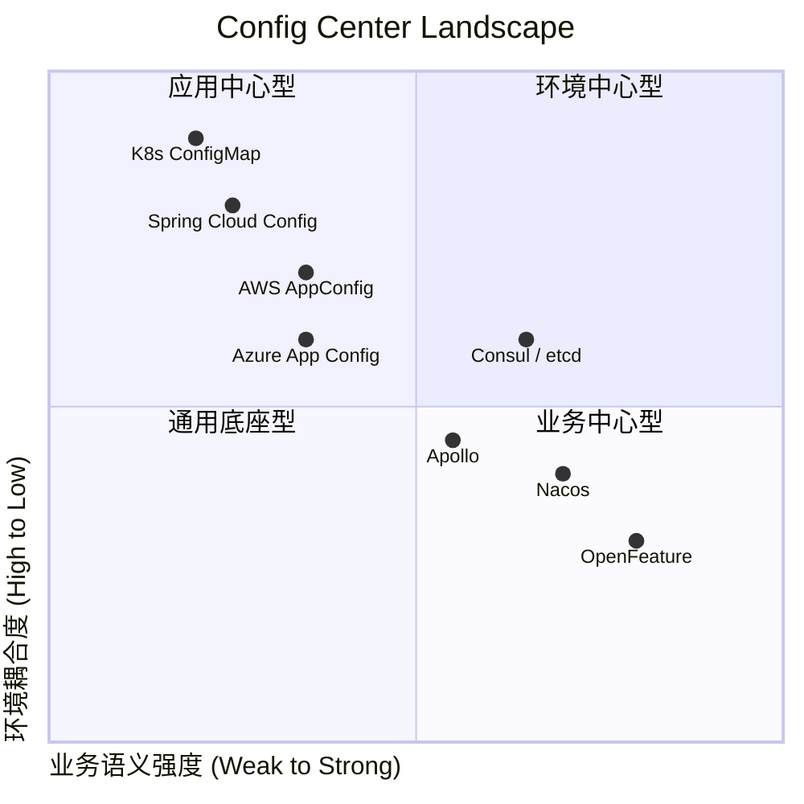

# Atlas Demo Web

这是 Atlas 项目的 Web 客户端模块，用于测试和演示如何使用 gRPC 客户端调用远程服务。

## 功能特性

- ✅ **gRPC 客户端集成** - 使用 Spring Boot gRPC 客户端
- ✅ **Protocol Buffers 支持** - 自动生成 protobuf 类
- ✅ **服务调用测试** - 完整的 UserService 和 OrderService 客户端测试
- ✅ **Spring Boot 集成** - 基于 Spring Boot 的 Web 应用
- ✅ **微服务架构** - 连接独立的 up-server 和 down-server

## 项目结构

atlas-demo-web/
├── src/main/
│   ├── java/io/github/nianien/atlas/demo/client/
│   │   ├── AtlasDemoClientApplication.java    # 主应用类
│   │   ├── GrpcClientTest.java               # gRPC 客户端测试
│   │   └── ProtobufVerification.java         # Protobuf 验证类
│   ├── proto/
│   │   ├── user.proto                        # 用户服务定义
│   │   └── order.proto                       # 订单服务定义
│   └── resources/
│       └── application.yml                   # 客户端配置
├── pom.xml                                   # Maven 配置
└── README.md                                 # 项目说明
```

## 如何运行

### 1. 编译项目

```bash
# 生成 protobuf 类并编译
mvn clean compile
```

### 2. 启动服务端

首先需要启动独立的服务器：

```bash
# 启动 UserService (up-server) - 端口 8081
cd ../atlas-demo-up-server
mvn spring-boot:run

# 启动 OrderService (down-server) - 端口 8082  
cd ../atlas-demo-down-server
mvn spring-boot:run
```

或者使用启动脚本：

```bash
cd ../
./start-servers.sh
```

### 3. 运行 Web 客户端

```bash
mvn spring-boot:run
```

## 配置说明

Web 客户端配置在 `src/main/resources/application.yml` 中：

```yaml
spring:
  application:
    name: atlas-demo-web

grpc:
  client:
    # UserService 客户端配置 - 连接 up-server
    user-service:
      address: 'static://localhost:8081'
      negotiationType: plaintext
    
    # OrderService 客户端配置 - 连接 down-server
    order-service:
      address: 'static://localhost:8082'
      negotiationType: plaintext
```

## 测试功能

Web 客户端会自动执行以下测试：

### UserService 测试 (连接 up-server:8081)
- `GetUser` - 获取用户信息
- `CreateUser` - 创建新用户

### OrderService 测试 (连接 down-server:8082)
- `CreateOrder` - 创建订单（会调用 UserService 验证用户）
- `GetOrder` - 获取订单信息
- `GetUserOrders` - 获取用户订单列表（流式响应）

## 架构说明

```
atlas-demo-web (端口随机)
    ├── gRPC Client → up-server:8081 (UserService)
    └── gRPC Client → down-server:8082 (OrderService)
                          └── gRPC Client → up-server:8081 (用户验证)
```

## 生成的文件

运行 `mvn compile` 后，会在以下位置生成 protobuf 类：

```
target/generated-sources/protobuf/
├── java/                          # protobuf 消息类
│   └── io/github/nianien/atlas/demo/proto/
└── grpc-java/                     # gRPC 服务存根
    └── io/github/nianien/atlas/demo/proto/
```

## 依赖说明

- **Spring Boot** - 应用框架
- **gRPC** - RPC 通信框架
- **Protocol Buffers** - 序列化协议
- **grpc-spring-boot-starter** - Spring Boot gRPC 集成
